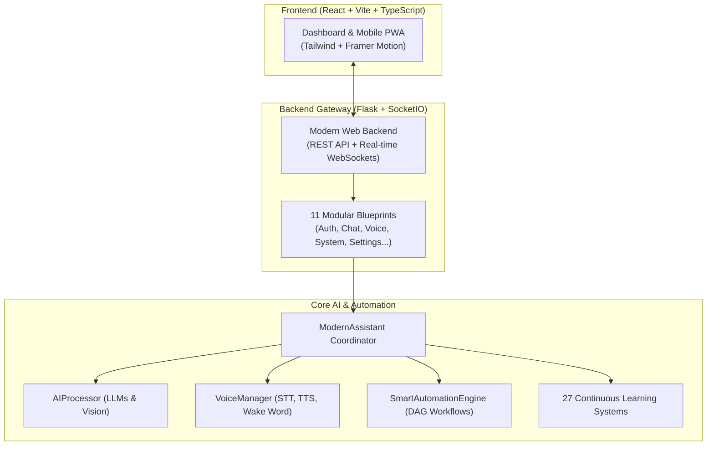

# 🌌 YourDaddy AI Assistant (v4.0.0)

<div align="center">
  <h3><strong>Native Windows OS Automation & Personal AI Companion</strong></h3>
  <p><em>Offline-First Multi-Modal LLM Assistant with Continuous Online Learning & Voice Interaction</em></p>
  
  [](LICENSE)
  [](https://python.org)
  [](https://react.dev)
  [](https://typescriptlang.org)
</div>

---

## 📖 Overview

**YourDaddy AI Assistant** is a desktop AI companion built for Windows that combines **speech recognition, computer vision, continuous machine learning, and native OS automation**. It operates with local offline models (Ollama/GGUF) or cloud AI providers (Google Gemini, OpenAI).



---

## ✨ Key Capabilities

- 🎙️ **Multi-Engine Voice Stack**: Offline wake word detection, Edge-TTS neural voices, Whisper STT, and voice activity detection (VAD).
- 👁️ **Computer Vision & OCR**: Screen understanding, multimodal visual Q&A, and document text extraction.
- ⚡ **Desktop Automation**: Open/close apps, media playback (Spotify), volume adjustments, and DAG-based task workflows.
- 🧠 **Continuous Online Learning**: 27 machine learning subsystems that adapt to your habits, slang (Hinglish/Hindi/English), and command patterns.
- 🔒 **Security First**: PIN-based JWT authentication, AES encrypted SQLite databases, strict rate-limiting, and input sanitization.
- 🌐 **Modern React Dashboard**: 3-column desktop layout with mobile responsive PWA mode and real-time system monitoring telemetry.

---

## 🚀 Quick Start

### Prerequisites
- **Python 3.11+**
- **Node.js 18+** & **npm**
- **Windows 10/11** (Primary target)

### 1. Installation

Clone the repository and install dependencies:

```bash
# Clone the repository
git clone https://github.com/your-username/Ai_Assistant.git
cd Ai_Assistant

# Install backend dependencies (Choose your tier):
# Tier 1: Base Web API & Security
pip install -r config/requirements/base.txt

# Tier 2: Voice & Audio processing
pip install -r config/requirements/voice.txt

# Tier 3: All dependencies (Full ML & AI suite)
pip install -r requirements.txt

# Install frontend dependencies
cd frontend/web-app
npm install
npm run build
cd ../..
```

### 2. Configuration

Copy environment template:

```bash
cp config/.env.example .env
```

Set your preferred PIN and keys in `.env`:
```ini
ADMIN_PIN=1234
ADMIN_PASSWORD=your_secure_password
GOOGLE_GEMINI_API_KEY=your_gemini_key_here
```

### 3. Launching the Assistant

```bash
# Start the Web Backend & Dashboard
python main.py --interface web --port 8000

# Start CLI Mode
python main.py --interface cli

# Start Native Windows Desktop App
python main.py --interface desktop_modern
```

---

## 📁 Repository Layout

```text
Ai_Assistant/
├── backend/                   # Flask server, WebSockets & 11 API Blueprints
│   ├── routes/                # Clean, decoupled route blueprints
│   └── modern_web_backend.py  # Server entry point
├── config/                    # Configuration, templates, and requirements
│   └── requirements/          # Modular requirements (base, ml, voice, dev)
├── core_ai/                   # Core Python AI, ML, and Automation engine
│   └── src/ai_assistant/
│       ├── ai/                # LLM providers, semantic cache, memory
│       ├── automation/        # Workflow engine, task runner, app discovery
│       ├── core/              # Coordinator, voice manager, system telemetry, migrations
│       └── voice/             # STT, TTS, wake words, noise reduction
├── frontend/web-app/          # React 18 + TypeScript + Tailwind UI
├── docs/                      # Comprehensive documentation hub
│   └── README.md              # Master docs index
├── scripts/                   # Utilities, diagnostics, and setup scripts
└── tests/                     # Pytest suite & integration tests
```

---

## 🧪 Testing

```bash
# Run backend tests
pytest tests/ -v

# Run frontend tests
cd frontend/web-app
npm test
npm run typecheck
```

---

## 📚 Documentation

For complete technical documentation, visit the [Documentation Hub](file:///c:/Users/as705/OneDrive/Desktop/Ai_Assistant/docs/README.md):

- [Complete API Reference](file:///c:/Users/as705/OneDrive/Desktop/Ai_Assistant/docs/API_REFERENCE_COMPLETE.md)
- [How AI Learns (27 Systems)](file:///c:/Users/as705/OneDrive/Desktop/Ai_Assistant/docs/HOW_AI_LEARNS.md)
- [Voice Setup Guide](file:///c:/Users/as705/OneDrive/Desktop/Ai_Assistant/docs/VOICE_SETUP_COMPLETE.md)
- [Security Architecture](file:///c:/Users/as705/OneDrive/Desktop/Ai_Assistant/docs/SECURITY.md)
- [Deployment & Packaging Guide](file:///c:/Users/as705/OneDrive/Desktop/Ai_Assistant/docs/DEPLOYMENT_GUIDE.md)

---

## 📄 License

This project is licensed under the MIT License - see the [LICENSE](LICENSE) file for details.
