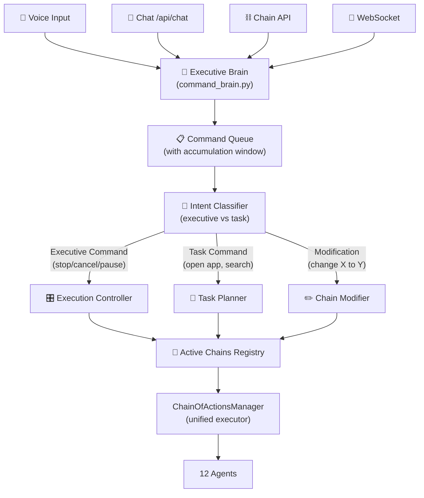

# PULSAR Executive Brain: Chain of Actions Fix + JARVIS Gap Closure

## Problem Statement

PULSAR currently acts as a "fire-and-forget" command machine. When you speak:
- **Command 1** → spawns Thread A, starts executing blindly
- **Command 2** (2 sec later) → spawns Thread B, runs in parallel, ignores Thread A
- **"Stop"** (5 sec later) → treated as a NEW command, tries to execute "stop" as automation
- **Command 3** (10 sec later) → spawns Thread C, all three threads fight for resources

**JARVIS would**: Listen continuously → accumulate intent → think about context → decide (execute / modify / queue / cancel) → verify → report back.

---

## Root Cause Analysis (Code Evidence)

### Bug 1: Duplicate Execution in TaskChainOrchestrator
[task_chain_orchestrator.py](file:///d:/Projects/Ai_Assistant/core_ai/src/ai_assistant/core/task_chain_orchestrator.py) **Lines 208-222** — `execute_step()` is called TWICE per step in `execute_chain()`:

```python
# Line 209: First call (result stored but then OVERWRITTEN)
step_result = self.execute_step(step)
results.append(step_result)

if step_result['success']:
    steps_completed += 1
# Line 214-222: Second call (overwrites the first)
step_success = False
step_result = None         # ← wipes the first result!
max_retries = 2

for attempt in range(max_retries + 1):
    step_result = self.execute_step(step)  # ← executes AGAIN
```

**Impact**: Every action (open app, send message, type text) runs twice. If it's "open WhatsApp", WhatsApp gets launched, then launched again.

---

### Bug 2: Two Competing Orchestrators, No Coordinator

| System | File | Entry Point | Type | Used By |
|--------|------|-------------|------|---------|
| `TaskChainOrchestrator` | [task_chain_orchestrator.py](file:///d:/Projects/Ai_Assistant/core_ai/src/ai_assistant/core/task_chain_orchestrator.py) | `execute_command()` | **Sync** | `/api/chat`, `/api/command` via [orchestrator_integration.py](file:///d:/Projects/Ai_Assistant/core_ai/src/ai_assistant/integrations/orchestrator_integration.py) |
| `ChainOfActionsManager` | [chain_of_actions_manager.py](file:///d:/Projects/Ai_Assistant/core_ai/src/ai_assistant/core/chain_of_actions_manager.py) | `execute_command()` | **Async** | `/api/chains/create` via [chain_routes.py](file:///d:/Projects/Ai_Assistant/backend/routes/chain_routes.py) |

Both have their own `execute_step()`, their own decomposition logic, their own verification, and their own singleton. **Neither knows the other exists.**

- Chat/voice commands go through `TaskChainOrchestrator` (sync, blocks the request thread)
- Chain API calls go through `ChainOfActionsManager` (async, spawns background thread)
- If user speaks via voice → goes to `TaskChainOrchestrator` (sync)
- If frontend calls chains API → goes to `ChainOfActionsManager` (async)
- **Nobody tracks "what is currently running" globally**

---

### Bug 3: Override Handler is Hollow

[conversation_context.py L242-259](file:///d:/Projects/Ai_Assistant/core_ai/src/ai_assistant/core/conversation_context.py):

```python
def handle_override(self, new_command: str):
    # Saves paused state to context vars...
    self.set_var('paused_task_chain', self.context.current_task_chain)
    self.set_var('paused_step', self.context.current_step)
    self.clear_task_chain()  # Clears context JSON...
    # BUT: the background thread is STILL RUNNING
    # There is NO mechanism to signal the thread to stop
```

The thread that's executing actions has no reference to a cancellation flag. It just keeps going.

---

### Bug 4: Fire-and-Forget Threading in chain_routes.py

[chain_routes.py L56-70](file:///d:/Projects/Ai_Assistant/backend/routes/chain_routes.py):

```python
def run_chain_background(chain_obj):
    # Creates its own event loop, runs to completion
    # No cancellation token, no reference stored
    new_loop = asyncio.new_event_loop()
    new_loop.run_until_complete(_run())  # ← blocks until done

thread = threading.Thread(target=run_chain_background, args=(chain,))
thread.start()  # ← fire and forget, thread reference lost
```

---

## Architecture: The Executive Brain

The fix is a single **Executive Brain** that sits between ALL input sources (voice, chat, chains API) and ALL execution systems.



---

## User Review Required

> [!IMPORTANT]
> **Accumulation Window**: When you say "open Chrome" and then 2 seconds later say "and search for weather", the Brain should wait a configurable window (default: 3 seconds of silence) before executing, to accumulate related commands into one chain. Do you want this window to be configurable from the settings UI?

> [!WARNING]
> **Breaking Change**: The `TaskChainOrchestrator` (sync) and `ChainOfActionsManager` (async) will be unified. The sync orchestrator will become a thin wrapper that delegates to the async system. This means `/api/chat` multi-step handling will change from blocking to async-with-polling. The frontend `TaskStatus.tsx` already supports this via WebSocket progress events.

---

## Open Questions

1. **Accumulation window duration**: Default 3 seconds — should this be adjustable per-user?
2. **Parallel chains**: Should PULSAR ever run two unrelated chains simultaneously (e.g., "download file" while "playing music"), or always sequential?
3. **Voice priority**: If you're typing a chat command and speak a voice command simultaneously, which takes priority?

---

## Proposed Changes

### Phase 1: Fix Critical Bugs (Immediate)

#### [MODIFY] [task_chain_orchestrator.py](file:///d:/Projects/Ai_Assistant/core_ai/src/ai_assistant/core/task_chain_orchestrator.py)

**Fix duplicate execution bug (L208-222)**:
- Remove the first `execute_step()` call at L209 that runs without retry/verification
- Keep only the retry-loop version (L219-243) which includes verification
- This single change fixes the "every action runs twice" bug

**Add cancellation check in execute_chain loop**:
- Check `self.context_manager.get_state() == ExecutionState.PAUSED` between steps
- If paused/cancelled, break out of loop cleanly

---

#### [MODIFY] [chain_of_actions_manager.py](file:///d:/Projects/Ai_Assistant/core_ai/src/ai_assistant/core/chain_of_actions_manager.py)

**Already partially done** — cancellation check added to `execute_chain` while loop. Additional changes:
- Add a `threading.Event` cancellation flag per chain (`_cancel_events: Dict[str, threading.Event]`)
- Check `_cancel_events[chain_id].is_set()` in the action execution loop
- Store thread references so they can be interrupted

---

#### [MODIFY] [chain_routes.py](file:///d:/Projects/Ai_Assistant/backend/routes/chain_routes.py)

**Already partially done** — executive override interception added to `/api/chains/create`. Additional changes:
- Store thread references in a `_running_threads` dict
- On cancel, set the chain's cancel event AND flag the chain status
- Add `/api/chains/active` endpoint to list all running chains

---

### Phase 2: Executive Brain (Core Feature)

#### [NEW] [command_brain.py](file:///d:/Projects/Ai_Assistant/core_ai/src/ai_assistant/core/command_brain.py)

The central intelligence that replaces direct execution calls. ~400 lines.

```python
class ExecutiveBrain:
    """
    Central command processor — the 'thinking' layer between input and execution.
    
    Responsibilities:
    1. Receive ALL commands from ALL sources (voice, chat, API)
    2. Classify: Is this an executive command (stop/cancel) or a task?
    3. Accumulate: Wait for follow-up commands within a time window
    4. Decide: Execute new chain? Modify running chain? Cancel?
    5. Track: Know what's running, what's queued, what's done
    """
    
    def __init__(self):
        self._command_queue: Queue = Queue()
        self._accumulation_buffer: List[TimestampedCommand] = []
        self._accumulation_window: float = 3.0  # seconds
        self._active_chains: Dict[str, ManagedChain] = {}
        self._brain_thread: Thread  # single background processor
        self._chain_manager: ChainOfActionsManager
        self._context: ContextManager
    
    async def receive_command(self, command: str, source: str) -> BrainResponse:
        """Single entry point for ALL commands from ALL sources"""
        
    def _classify_command(self, command: str) -> CommandClassification:
        """
        Returns one of:
        - EXECUTIVE_STOP: Cancel current execution
        - EXECUTIVE_PAUSE: Pause current execution  
        - EXECUTIVE_RESUME: Resume paused execution
        - TASK_NEW: Start a new task chain
        - TASK_APPEND: Add to the currently accumulating chain
        - TASK_MODIFY: Change parameters of running/queued chain
        - CONVERSATIONAL: Not an action, just chat
        """
        
    def _accumulate_or_execute(self, command: TimestampedCommand):
        """
        If last command was < accumulation_window ago:
            → Merge into buffer, reset timer
        Else:
            → Flush buffer as single chain, start new buffer
        """
        
    def _flush_buffer(self):
        """Combine accumulated commands into one ActionChain and execute"""
        
    def cancel_active(self, chain_id: str = None):
        """Cancel specific chain or all active chains"""
        
    def get_status(self) -> Dict:
        """What's running, what's queued, what's the brain doing"""
```

Key behaviors:
- **Accumulation**: "Open Chrome" → wait 3s → "and search weather" → combines into single chain: `[open_chrome, search_weather]`
- **Executive intercept**: "Stop" → instantly cancels all active chains, doesn't go through decomposition
- **Modification**: "Wait, not Chrome, use Firefox" → modifies the queued/buffered chain before execution
- **Parallel awareness**: "Also play music" → if unrelated to current chain, can run in parallel
- **Source tracking**: Knows if command came from voice (high priority) or chat (can queue)

---

#### [NEW] [command_models.py](file:///d:/Projects/Ai_Assistant/core_ai/src/ai_assistant/core/command_models.py)

Data models for the brain system. ~100 lines.

```python
@dataclass
class TimestampedCommand:
    text: str
    timestamp: float
    source: str  # 'voice', 'chat', 'api', 'websocket'
    priority: int  # 1=executive, 2=task, 3=conversational

class CommandClassification(Enum):
    EXECUTIVE_STOP = "executive_stop"
    EXECUTIVE_PAUSE = "executive_pause"
    EXECUTIVE_RESUME = "executive_resume"
    TASK_NEW = "task_new"
    TASK_APPEND = "task_append"
    TASK_MODIFY = "task_modify"
    CONVERSATIONAL = "conversational"

@dataclass
class ManagedChain:
    chain: ActionChain
    thread: Optional[Thread]
    cancel_event: threading.Event
    source: str
    created_at: float

@dataclass
class BrainResponse:
    action_taken: str  # 'executing', 'queued', 'cancelled', 'accumulated', 'chatting'
    message: str
    chain_id: Optional[str]
    active_chains: List[str]
```

---

#### [MODIFY] [orchestrator_integration.py](file:///d:/Projects/Ai_Assistant/core_ai/src/ai_assistant/integrations/orchestrator_integration.py)

Replace direct `TaskChainOrchestrator` calls with `ExecutiveBrain` routing:

```python
def process_with_orchestrator(command: str, context=None) -> Dict:
    brain = get_executive_brain()
    response = brain.receive_command(command, source='chat')
    # ... format response
```

This means `/api/chat` and `/api/command` automatically go through the brain without changing their API contracts.

---

#### [MODIFY] [chat_routes.py](file:///d:/Projects/Ai_Assistant/backend/routes/chat_routes.py)

- L34-66: Replace the `should_use_orchestrator()` check with `brain.receive_command()`
- L138-171: Same for `/api/command`
- The brain decides internally whether to use multi-step orchestration or direct chat

---

#### [MODIFY] [websockets.py](file:///d:/Projects/Ai_Assistant/backend/websockets.py)

- `enhanced_chat` handler: Route through brain instead of direct `assistant.process_enhanced_chat()`
- Add new WebSocket event `brain_status` that emits the brain's current state (what's running, what's queued)
- Add `command_override` WebSocket event for real-time cancellation from frontend

---

#### [MODIFY] [conversation_context.py](file:///d:/Projects/Ai_Assistant/core_ai/src/ai_assistant/core/conversation_context.py)

- `handle_override()` (L242): Instead of just clearing context, call `brain.cancel_active()`
- Add `get_active_execution_id()` method that returns the currently running chain ID
- Add `is_busy()` → True if any chain is executing

---

### Phase 3: Unify the Dual Orchestrators

#### [MODIFY] [task_chain_orchestrator.py](file:///d:/Projects/Ai_Assistant/core_ai/src/ai_assistant/core/task_chain_orchestrator.py)

Convert to a **thin sync wrapper** around `ChainOfActionsManager`:

```python
class TaskChainOrchestrator:
    """Now delegates to ChainOfActionsManager for actual execution."""
    
    def execute_command(self, command: str) -> ExecutionResult:
        """Sync entry point — runs async chain manager in a new loop."""
        brain = get_executive_brain()
        response = brain.receive_command(command, source='orchestrator')
        # Convert BrainResponse to ExecutionResult for backward compat
```

This keeps backward compatibility (all existing code that calls `get_orchestrator().execute_command()` still works) while routing through the brain.

The actual execution logic (L288-544 `execute_step()` with its 15+ intent handlers) moves into an `IntentExecutor` class that `ChainOfActionsManager._execute_action()` calls, replacing the simulated fallback.

---

#### [NEW] [intent_executor.py](file:///d:/Projects/Ai_Assistant/core_ai/src/ai_assistant/core/intent_executor.py)

Consolidates the 15+ intent handlers from `TaskChainOrchestrator.execute_step()` into a reusable class. ~350 lines.

```python
class IntentExecutor:
    """
    Executes individual intents with context awareness and verification.
    Extracted from TaskChainOrchestrator to be shared by both orchestration systems.
    """
    
    def execute(self, intent: str, params: Dict, context: ContextManager) -> Dict:
        """Route intent to handler"""
        handlers = {
            'open_app': self._open_app,
            'send_message': self._send_message,
            'type_text': self._type_text,
            'find_file': self._find_file,
            'move_file': self._move_file,
            'set_brightness': self._set_brightness,
            'toggle_wifi': self._toggle_wifi,
            'send_file': self._send_file,
            'check_taskbar': self._check_taskbar,
            'play_video': self._play_video,
            'skip_time': self._skip_time,
            # ... all handlers from TaskChainOrchestrator
        }
    
    def verify(self, intent: str, result: Dict, params: Dict) -> bool:
        """3-layer verification (code return → system state → VLM)"""
```

---

### Phase 4: Frontend Integration

#### [MODIFY] [DashboardContext.tsx](file:///d:/Projects/Ai_Assistant/frontend/web-app/src/contexts/DashboardContext.tsx)

- Subscribe to new WebSocket event `brain_status` to show brain state in UI
- When user sends voice/text command, show "🧠 Thinking..." → "⏳ Accumulating..." → "🚀 Executing..."
- Add `cancelExecution()` function that emits `command_override` WebSocket event

#### [MODIFY] [TaskStatus.tsx](file:///d:/Projects/Ai_Assistant/frontend/web-app/src/components/CenterColumn/TaskStatus.tsx)

- Show a "Cancel" button when chain is active
- Show accumulation timer ("Listening for more commands... 2.1s")
- Show brain state (idle / accumulating / executing / paused)

---

### Phase 5: JARVIS Gaps (After Brain is Solid)

Once the brain is working, the remaining JARVIS gaps become easy to plug in:

| Gap | What to Build | Connects To |
|-----|--------------|-------------|
| Personal Knowledge Graph | [knowledge/personal_knowledge_graph.py](file:///d:/Projects/Ai_Assistant/core_ai/src/ai_assistant/knowledge/) | Brain uses it for context |
| Proactive Anticipation | Expand [proactive_anticipator.py](file:///d:/Projects/Ai_Assistant/core_ai/src/ai_assistant/core/proactive_anticipator.py) | Brain schedules proactive chains |
| Project Tracking | New `features/project_tracker.py` | Brain reports daily via briefing |
| Commitment Memory | Expand [user_dna.py](file:///d:/Projects/Ai_Assistant/core_ai/src/ai_assistant/ai/user_dna.py) | Brain tracks promises |
| Workflow Templates | 15 new YAML files in [templates/](file:///d:/Projects/Ai_Assistant/core_ai/src/ai_assistant/workflow/templates/) | Brain routes intents to templates |
| Real Daily Briefing | Expand [daily_briefing.py](file:///d:/Projects/Ai_Assistant/core_ai/src/ai_assistant/features/daily_briefing.py) | Brain triggers at morning |
| Personality Evolution | Expand [personality_engine.py](file:///d:/Projects/Ai_Assistant/core_ai/src/ai_assistant/ai/personality_engine.py) | Brain tracks interaction style |
| Emotional Intelligence | Expand [emotional_intelligence.py](file:///d:/Projects/Ai_Assistant/core_ai/src/ai_assistant/ai/emotional_intelligence.py) | Brain adjusts tone |

---

## Verification Plan

### Automated Tests

```bash
# Test 1: Duplicate execution fix
python -m pytest tests/unit/test_chain_execution_fix.py -v

# Test 2: Brain accumulation window
python -m pytest tests/unit/test_command_brain.py -v

# Test 3: Executive override (cancel mid-execution)
python -m pytest tests/unit/test_executive_override.py -v

# Test 4: Full chain import sanity
python -c "from ai_assistant.core.command_brain import ExecutiveBrain; print('✅ Brain imports OK')"
```

### Manual Verification

1. **Rapid-fire test**: Say "open Chrome" → wait 2s → "and search weather" → verify single chain with 2 actions
2. **Cancel test**: Say "open Notepad then open Word then open Excel" → wait 1s → "stop" → verify only first action completed
3. **Modification test**: Say "open Chrome" → wait 1s → "no wait, open Firefox instead" → verify Firefox opens, not Chrome
4. **Parallel test**: Start a long chain → say something conversational ("what's the time?") → verify chat responds while chain continues

---

## Implementation Order

| Priority | Change | Effort | Risk |
|----------|--------|--------|------|
| 🔴 P0 | Fix duplicate `execute_step()` in TaskChainOrchestrator | 10 min | Zero — pure bug fix |
| 🔴 P0 | Add `threading.Event` cancellation to ChainOfActionsManager | 30 min | Low |
| 🟡 P1 | Create `command_brain.py` + `command_models.py` | 3-4 hrs | Medium — new system |
| 🟡 P1 | Create `intent_executor.py` (extract from TaskChainOrchestrator) | 2 hrs | Low — code move |
| 🟡 P1 | Modify `orchestrator_integration.py` to route through brain | 30 min | Low |
| 🟢 P2 | Modify `chat_routes.py` and `websockets.py` to use brain | 1 hr | Medium |
| 🟢 P2 | Convert `TaskChainOrchestrator` to thin wrapper | 1 hr | Medium |
| 🔵 P3 | Frontend brain status UI (`DashboardContext`, `TaskStatus`) | 2 hrs | Low |
| 🔵 P3 | JARVIS gaps (knowledge graph, proactive, briefing, etc.) | 2-3 days | Low per item |

**Total estimated time: Phase 1-3 = 1-2 days, Phase 4 = half day, Phase 5 = 2-3 days**
