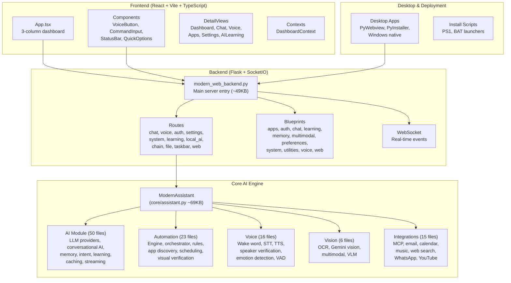

# 🔍 YourDaddy AI Assistant — Complete Project Analysis Report

> **Project**: YourDaddy AI Assistant v4.0.0  
> **Analysis Date**: 17 August 2026  
> **Analyzed By**: Antigravity (Claude Opus 4.6)  
> **License**: MIT

---

## 📊 Executive Summary

**YourDaddy AI Assistant** is an ambitious, feature-rich personal AI assistant built as a full-stack application with a Python backend and React/TypeScript frontend. It targets **Windows desktops** as the primary platform and integrates voice control, computer vision, system automation, multilingual support (Hindi/Hinglish/English), and multiple LLM providers (Gemini, OpenAI, Ollama).

| Metric | Value |
|---|---|
| **Total Source Files** | **515** |
| **Python Files** | 450 files · **118,513 lines** |
| **TypeScript/TSX** | 31 files · **5,746 lines** |
| **HTML** | 11 files · **3,883 lines** |
| **JSON configs** | 15 files · **1,689 lines** |
| **CSS** | 2 files · **676 lines** |
| **JS** | 6 files · **1,307 lines** |
| **Total Lines of Code** | **~131,814** |
| **Total Code Size** | **~5 MB** |
| **Documentation Files** | **78+ markdown docs** |
| **Test Files** | **38+ test files** |
| **Dependencies** | **~100+ Python packages** |

### Verdict

| Aspect | Rating | Notes |
|---|:---:|---|
| **Ambition & Feature Scope** | ⭐⭐⭐⭐⭐ | Extremely comprehensive vision |
| **Architecture** | ⭐⭐⭐ | Modular intent, but inconsistent execution |
| **Code Quality** | ⭐⭐⬛⬛⬛ | Significant duplication, dead code, fragile imports |
| **Security** | ⭐⭐⭐⬛⬛ | Good framework in place, but implementation gaps |
| **Testing** | ⭐⭐⬛⬛⬛ | Many test files exist, but coverage is thin |
| **Documentation** | ⭐⭐⭐⭐⬛ | Extensive docs, but many are stale/duplicated |
| **Production-Readiness** | ⭐⭐⬛⬛⬛ | Prototype-to-beta stage |
| **Frontend** | ⭐⭐⭐⬛⬛ | Clean React with TypeScript, but limited features |

---

## 🏗️ Architecture Overview



### Directory Structure

| Directory | Purpose | Key Files |
|---|---|---|
| [`main.py`](file:///c:/Users/Raghav%20Bajpai/OneDrive/Desktop/Ai_Assistant/main.py) | Entry point | CLI args, interface selection |
| [`backend/`](file:///c:/Users/Raghav%20Bajpai/OneDrive/Desktop/Ai_Assistant/backend) | Flask web server | Routes, WebSocket, services |
| [`core_ai/src/ai_assistant/`](file:///c:/Users/Raghav%20Bajpai/OneDrive/Desktop/Ai_Assistant/core_ai/src/ai_assistant) | Core AI engine | All AI/ML/automation logic |
| [`frontend/web-app/`](file:///c:/Users/Raghav%20Bajpai/OneDrive/Desktop/Ai_Assistant/frontend/web-app) | React dashboard | Vite + React + TailwindCSS |
| [`config/`](file:///c:/Users/Raghav%20Bajpai/OneDrive/Desktop/Ai_Assistant/config) | Configuration | Settings, env templates, requirements |
| [`desktop/`](file:///c:/Users/Raghav%20Bajpai/OneDrive/Desktop/Ai_Assistant/desktop) | Desktop packaging | PyWebview, PyInstaller |
| [`scripts/`](file:///c:/Users/Raghav%20Bajpai/OneDrive/Desktop/Ai_Assistant/scripts) | Utility scripts | Setup, diagnostics, demos |
| [`tests/`](file:///c:/Users/Raghav%20Bajpai/OneDrive/Desktop/Ai_Assistant/tests) | Test suite | Unit, integration, e2e |
| [`docs/`](file:///c:/Users/Raghav%20Bajpai/OneDrive/Desktop/Ai_Assistant/docs) | Documentation | 78 markdown files |

---

## 🧠 Core AI Engine Analysis

### AI Module — `core_ai/src/ai_assistant/ai/` (50 files, ~750KB)

This is the heart of the project. Key components:

| File | Size | Purpose | Assessment |
|---|---|---|---|
| [`conversational_ai.py`](file:///c:/Users/Raghav%20Bajpai/OneDrive/Desktop/Ai_Assistant/core_ai/src/ai_assistant/ai/conversational_ai.py) | 85KB, 1777 lines | Context switching, mood detection, multi-turn conversations | ⚠️ Monolithic — should be split |
| [`llm_provider.py`](file:///c:/Users/Raghav%20Bajpai/OneDrive/Desktop/Ai_Assistant/core_ai/src/ai_assistant/ai/llm_provider.py) | 20KB | OpenAI, Gemini, local model abstraction | ✅ Clean abstract base class design |
| [`memory.py`](file:///c:/Users/Raghav%20Bajpai/OneDrive/Desktop/Ai_Assistant/core_ai/src/ai_assistant/ai/memory.py) | 24KB | SQLite-based conversation memory | ✅ Solid implementation |
| [`enhanced_learning.py`](file:///c:/Users/Raghav%20Bajpai/OneDrive/Desktop/Ai_Assistant/core_ai/src/ai_assistant/ai/enhanced_learning.py) | 28KB | Online learning from interactions | ⚠️ Complex, needs validation |
| [`advanced_feedback_learning.py`](file:///c:/Users/Raghav%20Bajpai/OneDrive/Desktop/Ai_Assistant/core_ai/src/ai_assistant/ai/advanced_feedback_learning.py) | 30KB | Feedback-based model improvement | ⚠️ Experimental |
| [`intent_classification.py`](file:///c:/Users/Raghav%20Bajpai/OneDrive/Desktop/Ai_Assistant/core_ai/src/ai_assistant/ai/intent_classification.py) | 21KB | NLU intent extraction | ✅ Well-structured |
| [`semantic_cache.py`](file:///c:/Users/Raghav%20Bajpai/OneDrive/Desktop/Ai_Assistant/core_ai/src/ai_assistant/ai/semantic_cache.py) | 15KB | Embedding-based response caching | ✅ Smart optimization |
| [`federated_learning.py`](file:///c:/Users/Raghav%20Bajpai/OneDrive/Desktop/Ai_Assistant/core_ai/src/ai_assistant/ai/federated_learning.py) | 19KB | Privacy-preserving federated learning | 🔬 Research-grade, not production |
| [`graph_neural_networks.py`](file:///c:/Users/Raghav%20Bajpai/OneDrive/Desktop/Ai_Assistant/core_ai/src/ai_assistant/ai/graph_neural_networks.py) | 16KB | GNN-based knowledge graphs | 🔬 Research-grade |
| [`qlora_trainer.py`](file:///c:/Users/Raghav%20Bajpai/OneDrive/Desktop/Ai_Assistant/core_ai/src/ai_assistant/ai/qlora_trainer.py) | 16KB | QLoRA fine-tuning | 🔬 Advanced but niche |

> [!WARNING]
> The AI module contains **50 files** with considerable overlap. Multiple files implement similar functionality (e.g., `intent_recognizer.py` vs `intent_classification.py`, `query_cache.py` vs `semantic_cache.py`). This creates maintenance burden and confusion about which module to use.

### Core Module — `core_ai/src/ai_assistant/core/` (42 files, ~780KB)

| File | Size | Purpose | Assessment |
|---|---|---|---|
| [`assistant.py`](file:///c:/Users/Raghav%20Bajpai/OneDrive/Desktop/Ai_Assistant/core_ai/src/ai_assistant/core/assistant.py) | 69KB, 1428 lines | Central `ModernAssistant` class | ❌ **God object** — does too much |
| [`chain_of_actions_manager.py`](file:///c:/Users/Raghav%20Bajpai/OneDrive/Desktop/Ai_Assistant/core_ai/src/ai_assistant/core/chain_of_actions_manager.py) | 41KB | Multi-step task orchestration | ⚠️ Complex but valuable |
| [`performance_optimization.py`](file:///c:/Users/Raghav%20Bajpai/OneDrive/Desktop/Ai_Assistant/core_ai/src/ai_assistant/core/performance_optimization.py) | 42KB | Caching, lazy loading, profiling | ✅ Comprehensive |
| [`input_validation.py`](file:///c:/Users/Raghav%20Bajpai/OneDrive/Desktop/Ai_Assistant/core_ai/src/ai_assistant/core/input_validation.py) | 26KB | Command sanitization, injection prevention | ✅ Thorough |
| [`encrypted_database.py`](file:///c:/Users/Raghav%20Bajpai/OneDrive/Desktop/Ai_Assistant/core_ai/src/ai_assistant/core/encrypted_database.py) | 15KB | AES-encrypted SQLite storage | ✅ Good security practice |
| [`audit_logger.py`](file:///c:/Users/Raghav%20Bajpai/OneDrive/Desktop/Ai_Assistant/core_ai/src/ai_assistant/core/audit_logger.py) | 29KB | Security audit logging | ✅ Enterprise-grade |
| [`privacy_consent.py`](file:///c:/Users/Raghav%20Bajpai/OneDrive/Desktop/Ai_Assistant/core_ai/src/ai_assistant/core/privacy_consent.py) | 20KB | GDPR-style consent management | ✅ Good practice |

### Automation Module — `core_ai/src/ai_assistant/automation/` (23 files, ~640KB)

| File | Size | Purpose | Assessment |
|---|---|---|---|
| [`automation_engine.py`](file:///c:/Users/Raghav%20Bajpai/OneDrive/Desktop/Ai_Assistant/core_ai/src/ai_assistant/automation/automation_engine.py) | 76KB, 1899 lines | Workflow engine with DAG execution | ❌ **Too large** — needs decomposition |
| [`app_discovery.py`](file:///c:/Users/Raghav%20Bajpai/OneDrive/Desktop/Ai_Assistant/core_ai/src/ai_assistant/automation/app_discovery.py) | 61KB | Windows app detection via registry/Start Menu | ⚠️ Windows-only, complex |
| [`templates.py`](file:///c:/Users/Raghav%20Bajpai/OneDrive/Desktop/Ai_Assistant/core_ai/src/ai_assistant/automation/templates.py) | 59KB | Pre-built workflow templates | ✅ Useful but bloated |
| [`security.py`](file:///c:/Users/Raghav%20Bajpai/OneDrive/Desktop/Ai_Assistant/core_ai/src/ai_assistant/automation/security.py) | 59KB | Automation sandboxing, permission checks | ✅ Critical for safety |
| [`context_aware.py`](file:///c:/Users/Raghav%20Bajpai/OneDrive/Desktop/Ai_Assistant/core_ai/src/ai_assistant/automation/context_aware.py) | 53KB | Context-based automation triggers | ⚠️ Over-engineered |
| [`analytics.py`](file:///c:/Users/Raghav%20Bajpai/OneDrive/Desktop/Ai_Assistant/core_ai/src/ai_assistant/automation/analytics.py) | 54KB | Usage analytics and reporting | ⚠️ Very large for analytics |

### Voice Module — `core_ai/src/ai_assistant/voice/` (16 files, ~255KB)

| File | Size | Purpose | Assessment |
|---|---|---|---|
| [`voice_fingerprinting.py`](file:///c:/Users/Raghav%20Bajpai/OneDrive/Desktop/Ai_Assistant/core_ai/src/ai_assistant/voice/voice_fingerprinting.py) | 43KB | Speaker identification via voice biometrics | 🔬 Sophisticated |
| [`speaker_verification.py`](file:///c:/Users/Raghav%20Bajpai/OneDrive/Desktop/Ai_Assistant/core_ai/src/ai_assistant/voice/speaker_verification.py) | 33KB | Multi-speaker verification | 🔬 Research-grade |
| [`multilingual_wake_words.py`](file:///c:/Users/Raghav%20Bajpai/OneDrive/Desktop/Ai_Assistant/core_ai/src/ai_assistant/voice/multilingual_wake_words.py) | 33KB | Hindi/English wake word detection | ✅ Good feature |
| [`noise_reduction.py`](file:///c:/Users/Raghav%20Bajpai/OneDrive/Desktop/Ai_Assistant/core_ai/src/ai_assistant/voice/noise_reduction.py) | 29KB | Spectral noise reduction pipeline | ✅ Well-implemented |
| [`wake_word_detector.py`](file:///c:/Users/Raghav%20Bajpai/OneDrive/Desktop/Ai_Assistant/core_ai/src/ai_assistant/voice/wake_word_detector.py) | 14KB | Porcupine integration | ✅ Clean design |

---

## 🌐 Backend Analysis

### Flask Server — [`backend/modern_web_backend.py`](file:///c:/Users/Raghav%20Bajpai/OneDrive/Desktop/Ai_Assistant/backend/modern_web_backend.py)
- **1,294 lines, 49KB** — the main server entry point
- Uses Flask + Flask-SocketIO + Flask-JWT-Extended + Flask-Limiter
- Integrates CORS, rate limiting, JWT auth

### Routes (12 files in `backend/routes/`)

| Route File | Lines | Endpoints |
|---|---|---|
| [`settings_routes.py`](file:///c:/Users/Raghav%20Bajpai/OneDrive/Desktop/Ai_Assistant/backend/routes/settings_routes.py) | 34KB | User preferences, AI config, voice settings |
| [`chat_routes.py`](file:///c:/Users/Raghav%20Bajpai/OneDrive/Desktop/Ai_Assistant/backend/routes/chat_routes.py) | 33KB | Chat API, streaming, multi-step orchestration |
| [`learning_routes.py`](file:///c:/Users/Raghav%20Bajpai/OneDrive/Desktop/Ai_Assistant/backend/routes/learning_routes.py) | 16KB | AI learning dashboard data |
| [`system_routes.py`](file:///c:/Users/Raghav%20Bajpai/OneDrive/Desktop/Ai_Assistant/backend/routes/system_routes.py) | 14KB | System stats, health checks |
| [`auth_routes.py`](file:///c:/Users/Raghav%20Bajpai/OneDrive/Desktop/Ai_Assistant/backend/routes/auth_routes.py) | 13KB | PIN auth, JWT tokens |
| [`local_ai_routes.py`](file:///c:/Users/Raghav%20Bajpai/OneDrive/Desktop/Ai_Assistant/backend/routes/local_ai_routes.py) | 10KB | Ollama/local model management |
| [`file_routes.py`](file:///c:/Users/Raghav%20Bajpai/OneDrive/Desktop/Ai_Assistant/backend/routes/file_routes.py) | 10KB | File operations |
| [`voice_routes.py`](file:///c:/Users/Raghav%20Bajpai/OneDrive/Desktop/Ai_Assistant/backend/routes/voice_routes.py) | 7KB | Voice config, TTS/STT |

> [!IMPORTANT]
> **Critical Issue**: [`chat_routes.py`](file:///c:/Users/Raghav%20Bajpai/OneDrive/Desktop/Ai_Assistant/backend/routes/chat_routes.py#L13-L16) uses wildcard imports from `modern_web_backend.py` — this creates fragile, implicit dependencies:
> ```python
> from backend.modern_web_backend import *  # ❌ Wildcard import
> ```

### Duplicate Backend Code

There's a **nested backend** at [`backend/backend/`](file:///c:/Users/Raghav%20Bajpai/OneDrive/Desktop/Ai_Assistant/backend/backend) containing its own `app.py`, `main.py`, `routes.py`, `websocket.py`, and a full `blueprints/` directory with 12 files. This appears to be an older or alternative version that creates confusion about which is authoritative.

---

## 🎨 Frontend Analysis

### Technology Stack
- **React 18.3** with **TypeScript 5.5**
- **Vite 5.4** build tool
- **TailwindCSS 3.4** for styling
- **Framer Motion** for animations
- **Socket.IO Client** for real-time communication
- **Recharts** for data visualization
- **Lucide React** for icons
- **Driver.js** for onboarding tours

### Component Architecture

| Component | Purpose |
|---|---|
| [`App.tsx`](file:///c:/Users/Raghav%20Bajpai/OneDrive/Desktop/Ai_Assistant/frontend/web-app/src/App.tsx) | Root layout — 3-column desktop, tabbed mobile |
| `VoiceButton` | Central voice activation with animations |
| `CommandInput` | Text chat input |
| `StatusBar` | System status display |
| `QuickOptions` | Quick action shortcuts |
| `CameraFeed` | Camera/screen capture |
| `ConversationTracker` | Chat history panel |
| `AILearningDashboard` | Learning metrics mini-view |
| `OnboardingModal` | First-use setup wizard |
| `PWAInstallPrompt` | Progressive Web App install |
| `OfflineIndicator` | Network status |

### Frontend Assessment
- ✅ Clean component decomposition
- ✅ Context-based state management (`DashboardProvider`)
- ✅ Responsive design (mobile tabs + desktop grid)
- ✅ PWA support with service worker
- ⚠️ No state management library (may need Redux/Zustand as complexity grows)
- ⚠️ `package.json` still named `vite-react-typescript-starter` — not renamed

---

## 🔐 Security Analysis

### Strengths ✅
1. **JWT Authentication** with Flask-JWT-Extended
2. **Rate Limiting** via Flask-Limiter (60 req/min on chat)
3. **Input Sanitization** — dedicated [`input_sanitizer.py`](file:///c:/Users/Raghav%20Bajpai/OneDrive/Desktop/Ai_Assistant/core_ai/src/ai_assistant/core/input_sanitizer.py) (15KB) and [`input_validation.py`](file:///c:/Users/Raghav%20Bajpai/OneDrive/Desktop/Ai_Assistant/core_ai/src/ai_assistant/core/input_validation.py) (26KB)
4. **Encrypted Database** with AES encryption
5. **PIN Authentication** system
6. **Secrets Manager** — dedicated [`secrets_manager.py`](file:///c:/Users/Raghav%20Bajpai/OneDrive/Desktop/Ai_Assistant/core_ai/src/ai_assistant/core/secrets_manager.py) (10KB)
7. **Audit Logging** — comprehensive security event tracking
8. **Privacy Consent** system with GDPR-like controls
9. **CORS Configuration** with whitelist-based origins
10. **Permission System** — granular access control for automation

### Weaknesses ⚠️

> [!CAUTION]
> 1. **`--skip-auth` defaults to `True`** in [`main.py`](file:///c:/Users/Raghav%20Bajpai/OneDrive/Desktop/Ai_Assistant/main.py#L77):
>    ```python
>    parser.add_argument("--skip-auth", default=True)  # ❌ Auth bypassed by default!
>    ```
> 2. **All Gemini safety settings are `block_none`** in [`app_settings.json`](file:///c:/Users/Raghav%20Bajpai/OneDrive/Desktop/Ai_Assistant/config/app_settings.json#L38-L43):
>    ```json
>    "dangerousContent": "block_none",
>    "harassment": "block_none"
>    ```
> 3. **Wildcard imports** expose internal APIs to route handlers unexpectedly
> 4. **Hardcoded eSpeak path** in [`assistant.py`](file:///c:/Users/Raghav%20Bajpai/OneDrive/Desktop/Ai_Assistant/core_ai/src/ai_assistant/core/assistant.py#L524):
>    ```python
>    os.environ['PHONEMIZER_ESPEAK_LIBRARY'] = r'C:\Program Files\eSpeak NG\libespeak-ng.dll'
>    ```
> 5. **`.env.template`** lists sensitive keys as placeholders that might be committed if misused

---

## ⚡ Performance Analysis

### Strengths ✅
1. **Lazy Loading** — Components load on first access, not at startup
2. **Background Initialization** — Heavy AI models init in background threads
3. **System Stats Caching** — 2-second cache to avoid excessive `psutil` calls
4. **Network Speed Averaging** — Rolling 5-measurement average for smooth display
5. **Semantic Caching** — Embedding-based response caching to avoid redundant LLM calls
6. **Feature Flags** — Environment variables to disable unused components

### Concerns ⚠️
1. **Massive dependency tree** — 100+ packages including TensorFlow, PyTorch, transformers, scikit-learn creates a **multi-GB environment**
2. **`conversational_ai.py`** at 85KB loads many submodules → slow first-use
3. **No connection pooling** for SQLite databases
4. **Threading without proper synchronization** in some areas (e.g., `monitor_loop` reads shared state)
5. **`subprocess` calls** in automation without timeout limits in some paths

---

## 🧪 Testing Analysis

### Test Coverage

The [`tests/`](file:///c:/Users/Raghav%20Bajpai/OneDrive/Desktop/Ai_Assistant/tests) directory has **38 test files** + subdirectories:

| Test File | Lines | Tests |
|---|---|---|
| `test_complete_system.py` | 11KB | System integration |
| `test_voice_system.py` | 11KB | Voice pipeline |
| `test_automated_unit_tests.py` | 10KB | Auto-generated unit tests |
| `test_voice_integration.py` | 9KB | Voice service integration |
| `test_hindi_recognition.py` | 8KB | Hindi/Hinglish NLP |
| `test_task_execution.py` | 8KB | Task chain execution |
| `test_universal_controller.py` | 6KB | App controller |
| `test_voice_flow.py` | 6KB | Voice flow E2E |
| `test_vlm_integration.py` | 5KB | Vision-Language model |
| `test_pipeline_flow.py` | 4KB | Data pipeline |
| `conftest.py` | 4KB | Pytest fixtures |

### Testing Assessment
- ✅ Good test file coverage across features
- ✅ Pytest configuration with proper markers
- ⚠️ Many tests mock heavily — real integration testing is limited
- ⚠️ No CI/CD pipeline running tests automatically (GitHub Actions workflow directory exists but content unclear)
- ❌ No test coverage reporting configured
- ❌ Frontend has **zero tests** (no Jest/Vitest/Playwright configured)

---

## 📝 Documentation Analysis

The [`docs/`](file:///c:/Users/Raghav%20Bajpai/OneDrive/Desktop/Ai_Assistant/docs) directory contains **78 markdown files** (substantial for a personal project):

### Well-Documented Areas
- Voice setup and features (8+ docs)
- Security and authentication (6+ docs)
- Mobile access and deployment (6+ docs)
- AI learning system architecture (5+ docs)
- API reference and integration guides

### Documentation Issues
> [!WARNING]
> 1. **Massive duplication** — multiple docs cover the same topic (e.g., `VOICE_FIX_APPLIED.md`, `VOICE_FIX_COMPLETE.md`, `VOICE_SETUP_COMPLETE.md`, `VOICE_FEATURE_SUMMARY.md`, `VOICE_ASSISTANT_FEATURES.md`)
> 2. **Session-specific docs** that are changelog-like rather than reference docs (e.g., `FIX_ALL_ISSUES.md`, `FIX_APPLIED.md`, `FULL_SESSION_KNOWLEDGE_DUMP.md`)
> 3. **README.md** in the root is **328KB** — far too large for a README
> 4. Many docs reference features/files that may have since moved or changed

---

## 🐛 Issues & Technical Debt

### Critical Issues 🔴

1. **God Object Anti-Pattern**: [`assistant.py`](file:///c:/Users/Raghav%20Bajpai/OneDrive/Desktop/Ai_Assistant/core_ai/src/ai_assistant/core/assistant.py) (1,428 lines) handles voice, AI, automation, monitoring, multilingual, memory — all in one class.

2. **Duplicate/Parallel Codebases**: 
   - `backend/modern_web_backend.py` (49KB) vs `backend/backend/main.py` + `backend/backend/routes.py`
   - `desktop/launchers/yourdaddy_app.py` (42KB) appears to be a standalone duplicate
   - `modern_web_backend.py` exists in 3 locations: root, backend/, desktop/launchers/

3. **Wildcard Imports**: Routes import everything from `modern_web_backend` using `from backend.modern_web_backend import *`, making dependencies invisible.

4. **Unicode/Emoji Encoding Issues**: Many files contain garbled Unicode sequences (e.g., `ðŸâ€` instead of proper emojis), indicating encoding problems during file saves.

5. **Circular Import Risk**: Heavy use of try/except ImportError blocks with fallback stubs suggests circular dependency problems.

### Major Issues 🟡

6. **No Dependency Injection**: All services are instantiated inline with hard-coded imports.

7. **Missing Error Boundaries**: Frontend has no React error boundaries.

8. **Database Migration Strategy**: SQLite is used everywhere with inline `CREATE TABLE IF NOT EXISTS` — no migration tool.

9. **Inconsistent Logging**: Multiple logging systems coexist:
   - `utils/logging_config.py` (18KB)
   - `utils/advanced_logging.py` (11KB)
   - `utils/logging_completion.py` (15KB)
   - `utils/logging_analyzer.py` (12KB)
   - `utils/session_activity_logger.py` (17KB)
   - `utils/user_data_logger.py` (2KB)

10. **Feature Flag Sprawl**: Feature flags are scattered across env vars, JSON configs, and code constants with no central registry.

### Minor Issues 🟢

11. **Unused files**: `hii.ts` in root (4.7KB), `download_vosk.py` in root
12. **`.backup` files** checked into source: `session_activity_logger.py.backup`
13. **`package.json` name**: Still says `vite-react-typescript-starter`
14. **Commented-out imports** in `__init__.py` — dead code

---

## 🔧 Technology Stack Summary

### Backend Stack
| Technology | Version | Purpose |
|---|---|---|
| Python | ≥3.11 | Runtime |
| Flask | 3.1.0 | Web framework |
| Flask-SocketIO | 5.3.6 | Real-time WebSocket |
| Flask-JWT-Extended | 4.6.0 | Authentication |
| Flask-Limiter | 3.8.0 | Rate limiting |
| SQLite | Built-in | Local database |
| google-generativeai | 0.8.5 | Gemini AI |
| OpenAI | 2.8.0 | GPT models |
| TensorFlow | ≥2.16 | ML training |
| PyTorch | 2.3.1 | Deep learning |
| Transformers | 4.44.2 | NLP models |
| faster-whisper | — | Local STT |
| KittenTTS | — | Local TTS |
| Porcupine | — | Wake word detection |

### Frontend Stack
| Technology | Version | Purpose |
|---|---|---|
| React | 18.3.1 | UI framework |
| TypeScript | 5.5.3 | Type safety |
| Vite | 5.4.2 | Build tool |
| TailwindCSS | 3.4.1 | Styling |
| Framer Motion | 12.24.12 | Animations |
| Socket.IO Client | 4.8.3 | Real-time events |
| Recharts | 3.6.0 | Charts |
| Driver.js | 1.6.0 | Onboarding tours |

---

## 📋 Recommendations

### Priority 1 — Critical (Do Now)

| # | Action | Impact |
|---|---|---|
| 1 | **Set `--skip-auth` default to `False`** | Security |
| 2 | **Remove wildcard imports** — use explicit imports in all route files | Stability |
| 3 | **Delete duplicate `backend/backend/`** directory or merge with main backend | Clarity |
| 4 | **Fix Unicode encoding** — re-save all files with proper UTF-8 emojis | UX |
| 5 | **Reduce `requirements.txt`** — split into `base.txt`, `ml.txt`, `voice.txt`, `dev.txt` | Install time |

### Priority 2 — Important (Next Sprint)

| # | Action | Impact |
|---|---|---|
| 6 | **Decompose `assistant.py`** into `VoiceManager`, `AIProcessor`, `AutomationHandler`, `SystemMonitor` | Maintainability |
| 7 | **Decompose `automation_engine.py`** (1,899 lines) into smaller modules | Maintainability |
| 8 | **Consolidate logging** into a single, configurable logging system | Debugging |
| 9 | **Add frontend testing** — at minimum Vitest + React Testing Library | Quality |
| 10 | **Implement proper database migrations** (Alembic or custom versioning) | Data safety |

### Priority 3 — Nice to Have (Backlog)

| # | Action | Impact |
|---|---|---|
| 11 | Deduplicate AI modules (combine similar intent/cache/learning files) | Code health |
| 12 | Add React error boundaries to all detail views | UX |
| 13 | Consolidate 78 docs into ~15 well-organized docs | Dev experience |
| 14 | Add CI/CD pipeline with automated testing | Quality |
| 15 | Introduce dependency injection / service container pattern | Architecture |
| 16 | Trim README.md (328KB → ~10KB summary with links to docs) | Accessibility |
| 17 | Remove research-grade modules (federated learning, GNN) unless actively used | Focus |

---

## 🏁 Conclusion

**YourDaddy AI Assistant** is an impressively **ambitious project** with a wide scope: voice control, computer vision, system automation, multi-LLM support, multilingual NLU, MCP protocol integration, and desktop packaging. The breadth of features is remarkable for a personal/small-team project.

However, the project suffers from **organic growth patterns** typical of rapid prototyping:
- Code duplication across parallel implementations
- God objects and monolithic files
- Heavy dependency tree that makes installation difficult
- 78 documentation files that are hard to navigate

The **strongest areas** are the AI module's LLM provider abstraction, the security framework (encryption, audit logging, input validation), and the frontend's clean React architecture.

The **highest ROI improvements** would be: fixing the security defaults, removing dead/duplicate code, and decomposing the 3 largest files (`assistant.py`, `automation_engine.py`, `conversational_ai.py`).

The project has solid bones and with focused refactoring could become a genuinely useful, production-quality AI assistant.
